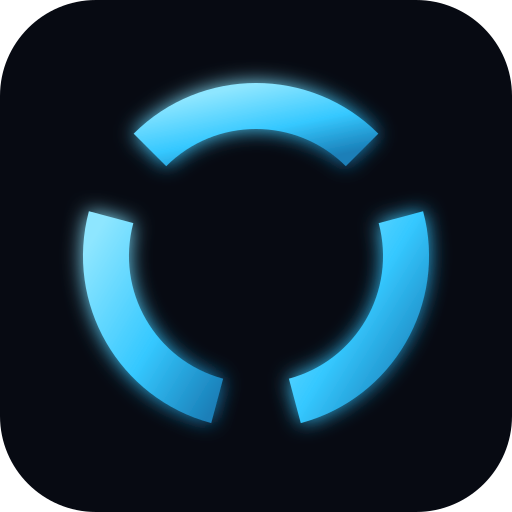
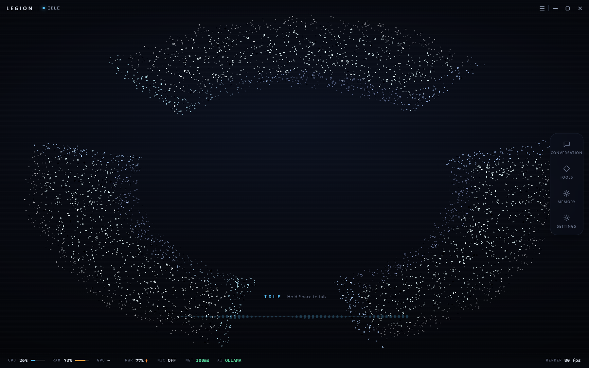

<div align="center">
  

  <h1>LEGION</h1>
  <p><strong>A personal AI intelligence living inside your computer.</strong></p>
</div>

---

LEGION is a desktop assistant built on Electron. It listens, speaks, watches its
own resource usage, and shows you what it is doing through a GPU-rendered
particle mark — three arc segments of a ring with gaps at 2, 6 and 10 o'clock.

The mark is not an image. Every point is sampled against an analytic ring
definition in a Web Worker and shaded in a fragment shader, so it reacts to
state (idle, listening, thinking, speaking), theme and system load in real time.

## Screens



## What it does

- **Voice** — push-to-talk, continuous listening and a configurable wake word, with
  end-of-turn and silence handling.
- **Visual mark** — a live segmented ring that reflects app state and system load.
- **Settings** — waveform, redaction, wake phrase, theme, and audio device controls
  that are actually wired to real state.
- **Confirmations** — a confirmation gate for anything with impact, so a tool call
  never happens silently.
- **First run** — a guided setup that can be dismissed and is safe to re-enter.

## Requirements

- Windows (the launchers are `.bat` and `.vbs`)
- Node.js 18 or newer
- A microphone, if you want to use the voice features

## Install

```bash
npm install
```

## Run

Double-click one of the launchers in the project root:

- **`Launch LEGION.vbs`** — silent, no console window. This is the recommended one.
- **`Launch LEGION.bat`** — keeps a console window, useful if you want to see
  startup errors.

Or from a terminal:

```bash
npm start        # normal
npm run dev      # with devtools
```

To verify a launcher end to end — that a titled window appears and the render
loop is alive rather than frozen or spinning:

```bash
npm run check:launch
```

## Checks

LEGION ships with a check suite. Each one is a real test against a live app or a
live static analysis, not a unit test with mocks.

```bash
npm run check       # everything
npm run check:fast  # static + scope self-test + IPC
```

| Script | What it covers |
|---|---|
| `npm run selftest` | The static-check scope analyzer's own test cases |
| `npm run check:static` | Syntax, missing handlers, DOM ids, and undeclared reads (acorn AST walk) |
| `npm run check:ipc` | Every `ipcMain` handler is registered and reachable |
| `npm run check:data` | The data layer: config, storage, round trips |
| `npm run check:voice` | STT/TTS routing, error paths, provider fallback |
| `npm run check:voicepack` | Voice pack: a listed phrase plays its clip, a miss falls through to SAPI, and a manifest cannot read outside its folder |
| `npm run check:firstrun` | First-run flow and dismiss handling |
| `npm run check:shell` | Live UI: geometry, panel behaviour, modals, settings round trips |
| `npm run check:render` | The live renderer: frame rate, element counts, WebGL errors |
| `npm run check:launch` | Double-clicks the real launcher: time to a titled window, and CPU delta to prove the render loop is alive and not spinning |

`check:static` parses every project file with acorn and reports undeclared reads
instead of trusting a hand-maintained list of globals. Vendored three.js is
skipped.

## Voice packs

Drop a `.wav` or `.mp3` in `voicepack/`, named after the phrase, and LEGION plays
that recording instead of synthesising those exact words:

```json
// voicepack/manifest.json
{ "phrase": "On it.", "file": "on-it.mp3" }
```

Matching is exact once case and punctuation are folded, so `"On it."`, `"on it"`
and `"  ON IT! "` all hit the same clip. Anything with no clip moves down to the
next voice source — there is no wildcard, because a catch-all would play one
clip for text it does not match, and the mark would appear to say something the
app never said.

A working example pack ships with six real clips. `voicepack/README.md` has the
format; `npm run voicepack:sample` regenerates them. An installed build also
reads `resources/voicepack` beside the exe, so you can edit clips without
repacking.

## Voice sources

LEGION speaks through the first source that can answer:

| # | Source | Notes |
|---|--------|-------|
| 1 | **Voice pack** | Your own recording. Instant and always offline. |
| 2 | **Online voice** | Microsoft Edge neural voices. Sends the text to that service, so it needs a network. |
| 3 | **Piper** | Local neural TTS. Optional; used only if you install it. |
| 4 | **System voice** | Windows SAPI. Always available, so speech never fails outright. |

If a source is missing, offline, or errors, LEGION quietly drops to the next one.

Settings → Voice → **Voice source** picks how far down that list it may go:

- **Voice pack, then online voice, then local fallback** — the default
- **Voice pack, then local fallback (never online)** — nothing leaves the machine
- **Voice pack only (silence if not recorded)** — prerecorded phrases only

The panel also reads out which sources are actually usable right now, rather
than listing options that would not work.

## Performance

`npm run bench` boots the real window and measures it — frame-time percentiles,
JS heap trend, DOM size and the adaptive quality tier:

```bash
npm run bench          # 30 s soak
npm run bench 600      # 10 minutes, for a leak claim
```

Measured over a 10-minute soak on the development machine:

| Metric | Result |
|---|---|
| Boot to first frame | 864 ms |
| Frame time | p50 12.1 ms, p95 24.2 ms, p99 30.3 ms |
| Frame rate | 81.7 fps mean, 76.8 fps at p5 |
| JS heap | 8.2 MB → 12.2 MB, peak envelope +0.42 MB over 600 s |
| DOM nodes | 270, flat for the whole session |
| Page exceptions | 0 |

The heap is the meaningful leak signal: the collector sawtooths between about
8 MB and 17 MB and the *peak envelope* — the ceiling, not the last sample —
stayed flat across ten minutes. Summing RSS across the Electron processes
instead reports ~820 MB, but that double-counts the large pages those processes
share, so it overstates real usage.

The sampler reads its own `requestAnimationFrame` timestamps rather than the
app's fps counter, so a misreported frame rate would still show up.

`bench` refuses to run while a LEGION instance is already alive, since a stray
process makes every number wrong. It also disables Chromium's occlusion
throttling for the run: a window sitting behind another window otherwise gets
rAF at about 1 Hz, which reads as a 20 fps app and makes adaptive quality drop to
the lowest tier for no reason of its own. That behaviour is the tier policy
working, not a fault — but it must not contaminate a measurement.

Adaptive quality, observed under that load: `ultra → high → medium → low`, and
back to `ultra` once frames recovered. The tier you pick is a ceiling, so adaptive
mode may drop below it under load but never climbs past it.

## Build a distributable

```bash
npm run dist
```

Outputs land in `release/`. Windows targets are an NSIS installer and a portable
executable.

## Project layout

```
src/
  main/        main process, window, IPC handlers
    ai/        provider-independent engine, provider adapters, personality
    voice/     SAPI TTS, voice packs, Windows STT, wake word
    tools/     36 tools, registry, sandbox
    system/    metrics
  renderer/    the UI, the mark, and the Web Worker that samples it
    visuals/   ring geometry, particle field, glyph atlas, stage
    js/        app shell, panels, audio
  preload/     the only renderer/main bridge
voicepack/     prerecorded clips, manifest.json
scripts/       the check suite and the benchmark
assets/        logo
```

`ARCHITECTURE.md` covers the process split, the state machine and the data flow.
`CONTRIBUTING.md` covers conventions, and how to add a channel, a tool or a state.

## Themes

`legion-dark`, `abyss`, `ember`, `mint` and `mono`. The accent propagates to the
CSS, the waveform and the ring shader together, so a theme change is consistent
across the whole app.

## License

MIT
